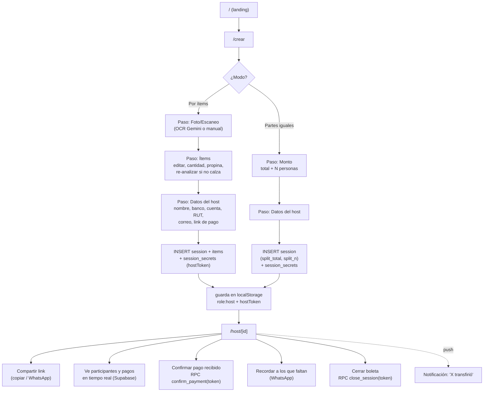
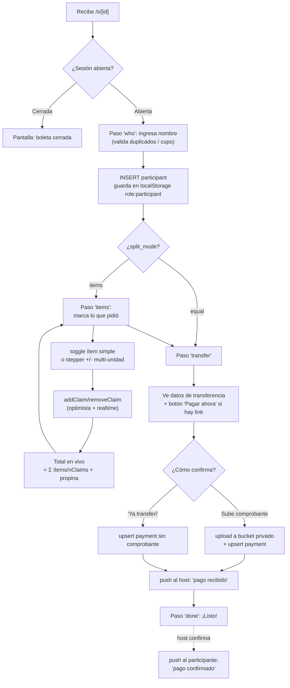

# Auditoría A-Pagar — Junio 2026

> Revisión de: responsividad, división de productos, selección de ítems por el anfitrión, e historial local. Incluye diagramas de flujo completos (creador y receptor del link).

> **Estado de implementación (post-auditoría):**
> - ✅ Responsivo: `min-h-screen`→`min-h-dvh` (15 usos), monto del participante y título hero con `clamp()`.
> - ✅ Dividir ÷N: botón **Dividir** al costado de cada ítem simple → vista de slots; se reparte entre quienes lo toquen (decisión: compartir ÷N, sin migración de items). Componente reutilizable `ItemsClaimList`.
> - ✅ Host marca su consumo: el host es un participante `is_host` (migración **007**); su consumo divide bien los compartidos pero se excluye del cobro. Panel host con sección "Lo que consumí yo".
> - ✅ Cuenta: el target por cobrar ahora excluye el consumo del host (cálculo por claim).
> - ℹ️ Historial local: sin cambios — sigue siendo por dispositivo (decisión pendiente sobre auth).

---

## 1. Resumen ejecutivo

| Área | Estado | Acción |
|---|---|---|
| Responsividad | 🟡 Buena base mobile-first, 3 fallas reales | Corregir `100vh`→`dvh`, footer sticky, montos largos |
| Dividir producto en 2 | 🟡 Existe "compartir" (÷N) pero **no** hay botón explícito de "Dividir en 2 slots" | Decisión de diseño pendiente (§3) |
| Anfitrión marca su consumo | 🔴 **No existe** — el host no es participante; su consumo se asume "resto no reclamado" | Cambio de modelo (§4) |
| Historial local "por user" | ℹ️ **No es por usuario** — es por navegador/dispositivo (`localStorage`), sin cuentas | Aclarado (§5) |

---

## 2. Auditoría de responsividad

La app es **mobile-first PWA**: todo el contenido vive en columnas `max-w-md` (448px) / `max-w-sm` (384px) centradas. En desktop se ve como una columna angosta centrada — **es intencional** (forma de teléfono), no es un bug.

### Fallas reales encontradas

1. **`min-h-screen` (100vh) en vez de `dvh` — FALLA MÓVIL REAL.**
   Se usa en 6 archivos (15 ocurrencias). En navegadores móviles con barra de direcciones dinámica, `100vh` no descuenta el chrome del browser. Combinado con el **total sticky** (`sticky bottom-0` en [s/[id]/page.tsx:370](src/app/s/[id]/page.tsx#L370)), el botón "Ver cómo transferir" puede quedar tapado por la barra del navegador en iOS Safari / Chrome Android. → Migrar a `min-h-dvh`.

2. **Montos largos en `text-4xl` mono pueden desbordar.**
   El total del participante ([s/[id]/page.tsx:520](src/app/s/[id]/page.tsx#L520)) usa `money text-4xl` sin `break`/`tabular` de respaldo. Un total tipo `$1.234.567` en pantalla de 320px (iPhone SE) queda al límite. → Agregar `tabular-nums` ya está, pero conviene `text-balance` o bajar a `text-3xl` bajo `max-[360px]`.

3. **Título hero `text-[3.1rem]` fijo** ([page.tsx:33](src/app/page.tsx#L33)).
   No escala hacia abajo. En 320px "cuenta" (49.6px extrabold) queda muy ajustado. → `text-[clamp(2.4rem,12vw,3.1rem)]`.

### Menores / aceptables
- Fila de chips de unidades múltiples (`flex-wrap`, [s/[id]/page.tsx:336](src/app/s/[id]/page.tsx#L336)) hace wrap correcto.
- El stepper + precio + nombre en ítems multi-unidad: el nombre `truncate` evita overflow. OK.
- Formulario de datos del host: una sola columna, sin problemas.

---

## 3. División de productos — estado actual vs. lo pedido

### Lo que YA existe
- **Compartir ítem (÷N):** si varias personas tocan el mismo ítem, el precio se divide automáticamente entre quienes lo reclaman (`price_per_person = ceil(price / nClaims)`, [utils.ts:56](src/lib/utils.ts#L56)). O sea, "que dos personas lo seleccionen para dividirlo" **ya está permitido y funciona**.
- **Ítems multi-unidad** (cantidad > 1): se crean N filas de `item` y hay un stepper +/− para tomar cuántas unidades quieres ([s/[id]/page.tsx:287](src/app/s/[id]/page.tsx#L287)).

### Lo que NO existe (lo que pides)
- Un **botón explícito "Dividir"** al costado del producto que lo parta en **2 slots** independientes (mitad y mitad), visibles como dos casilleros que se reclaman por separado.

### ⚠️ Restricción técnica importante
La migración **004** (`004_security_hardening.sql`) **eliminó** las policies de `UPDATE` y `DELETE` sobre `items`. Los ítems son **inmutables** una vez creados. `INSERT` sí sigue permitido. Esto condiciona el diseño:
- **No** se puede cambiar el precio de un ítem para "partirlo".
- Se puede **insertar** ítems hijos (dos de mitad de precio) pero **no borrarlos** después → "deshacer la división" requeriría otra estrategia.

Por eso el "cómo" de la división es una **decisión de diseño** (ver §6).

---

## 4. El anfitrión debe poder marcar su consumo

### Estado actual: NO puede
El anfitrión **no es un participante**. El modelo asume que **lo que nadie reclama = lo consumió el host y no se cobra** (ver comentario en [host/[id]/page.tsx:171-178](src/app/host/[id]/page.tsx#L171)). El panel del host (`/host/[id]`) **no tiene UI para marcar ítems**.

### Problema de correctitud que esto causa hoy
Si el host compartió un plato de $12.000 con un amigo y **solo el amigo** lo marca, el amigo paga **$12.000 completos** (÷1) en vez de $6.000. El host "comió gratis" en el cálculo, pero **sobrecobra al amigo**. Que el host pueda marcar lo suyo **corrige este bug real**.

### Lo que implica habilitarlo
1. Crear una identidad de "participante host" (columna `is_host` en `participants`, o guardar `host_participant_id`).
2. Agregar UI de marcado de ítems en el panel del host (hoy no existe).
3. Ajustar `targetToCollect`: el consumo del host **no se cobra**, pero **sí cuenta** como co-reclamante para dividir bien los platos compartidos.

→ Es un cambio de modelo. Detalle de opciones en §6.

---

## 5. Historial local — "¿es por user?"

**Respuesta: NO es por usuario. Es por navegador/dispositivo.**

- Se guarda en `localStorage` bajo la clave `apagar_sessions_v2` ([local-sessions.ts:17](src/lib/local-sessions.ts#L17)), máximo 60 entradas.
- **No hay cuentas ni login** (modelo MVP sin auth, ver README "Modelo de confianza").
- Implicaciones:
  - Si cambias de teléfono o navegador, **no ves tu historial**.
  - Si limpias datos del sitio / navegas en incógnito, **se pierde**.
  - Dos personas en el mismo dispositivo comparten el mismo historial.
- Guarda dos roles: `host` (con `hostToken` secreto) y `participant` (con `participantId`). El token de host **solo vive en ese dispositivo** — perderlo = no poder confirmar pagos de esa boleta.

Esto es coherente con el MVP, pero conviene decidir si se quiere persistencia real por usuario (requeriría auth ligera, p. ej. magic link).

---

## 6. Decisiones de diseño pendientes (antes de implementar)

### A) ¿Cómo debe funcionar "Dividir en 2"?
- **Opción 1 — Compartir explícito (sin tocar el schema):** botón "Dividir" que invita/marca el ítem como compartido; sigue usando ÷N. Si 2 personas lo toman, ÷2; si 3, ÷3. Simple, reversible, cero migración.
- **Opción 2 — Partir en 2 mitades fijas (slots):** "Dividir" inserta 2 ítems hijos de mitad de precio, cada uno reclamable por separado. Más literal a "2 slots", pero choca con la inmutabilidad (no se puede borrar para deshacer) y necesita migración/lógica nueva.

### B) ¿Cómo marca el host su consumo?
- **Opción 1 — Host como participante especial:** aparece en la lista marcado como "Anfitrión (no se cobra)", marca ítems desde su panel; su consumo divide bien los platos compartidos pero no se incluye en lo "por cobrar".
- **Opción 2 — Vista de participante para el host:** el host abre su propio `/s/[id]` como uno más, pero filtramos su pago.

---

## 7. Diagrama de flujo — CREADOR (anfitrión)



## 8. Diagrama de flujo — RECEPTOR DEL LINK (participante)



## 9. Recálculo de lo "por cobrar" (referencia)

```
Por ítems:  target = Σ (lo que reclamaron los PARTICIPANTES) + propina proporcional
            (lo no reclamado = consumo del host, NO se cobra)
Partes iguales: target = ceil(total / n) × (n − 1)   ← el host no se cobra a sí mismo
progreso = confirmado / target
```
> Si se habilita "host marca su consumo" (§4), el consumo del host pasa a contar como co-reclamante (divide bien los compartidos) pero se **excluye** de `target`.
